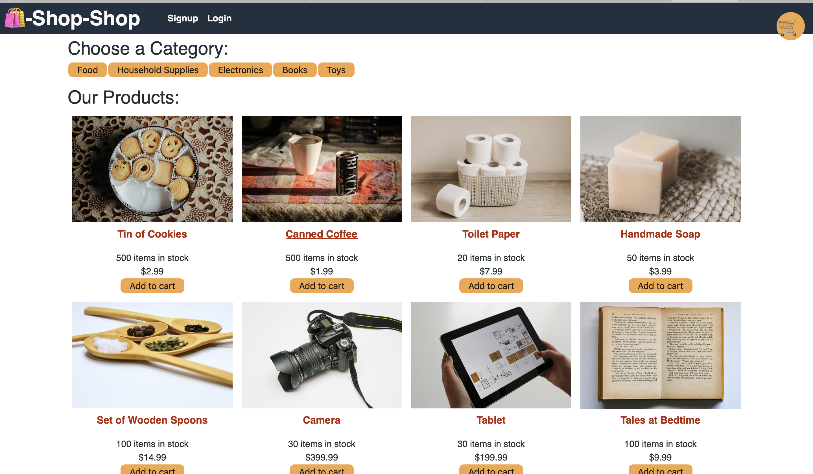

# E-Commerce Website Developed with the MERN stack
### Introduction
Github Repository
``` text 
anitapeppercorn/Shop-Shoppe-Redux
```
App is Deployed at:
``` text


```

I built a full stack - MERN Stack e-commerce site with Stripe for Payments. Then refactored this code. To use and deployed this application to Heroku. 


## Contents
- [Description](#Description)
- [App Screenshot](#App)
- [User Story](#User-Story)
- [Acceptance Criteria](#Acceptance-Criteria)
- [Concepts](#Concepts)
- [License](#License)
- [Author](#Author)

## Description

I have read and watched redux tutorials to refactor code from using primarily using react hooks and context API to incorporating Redux

### App Screenshot



## User Story
AS a senior engineer working on an e-commerce platform
I WANT my platform to use Redux to manage global state instead of the Context API
SO THAT my website's state management is taken out of the React ecosystem


## Acceptance Criteria
GIVEN an e-commerce platform that uses Redux to manage global state
WHEN I review the app’s store
THEN I find that the app uses a Redux store instead of the Context API
WHEN I review the way the React front end accesses the store
THEN I find that the app uses a Redux provider
WHEN I review the way the app determines changes to its global state
THEN I find that the app passes reducers to a Redux store instead of using the Context API
WHEN I review the way the app extracts state data from the store
THEN I find that the app uses Redux instead of the Context API
WHEN I review the way the app dispatches actions
THEN I find that the app uses Redux instead of the Context API


## Concepts

In addtition to Redux, this project I applied the following skills:
	”@apollo/react-hooks": "^3.1.3",
    "@stripe/stripe-js": "^1.10.0",
    "@testing-library/jest-dom": "^4.2.4",
    "@testing-library/react": "^9.5.0",
    "@testing-library/user-event": "^7.2.1",
    "apollo-boost": "^0.4.7",
    "apollo-link-context": "^1.0.20",
    "graphql": "^14.6.0",
    "graphql-tag": "^2.10.3",
    "jwt-decode": “^2.2.0",
    "apollo-server-express": "^2.11.0",
    "bcrypt": "^4.0.1",
    "express": "^4.17.1",
    "jsonwebtoken": "^8.5.1",
    "mongoose": "^5.9.7",
    "react": "^16.13.1",
    "react-dom": "^16.13.1",
    "react-router-dom": "^5.1.2",
    "react-scripts": "3.4.1"


## License
[MIT License](./LICENSE)


## Author: Anita Ganti

View the authors' portfolio at:  
https://anitapeppercorn.github.io/react-portfolio/
 


[Table of Content](#Table-of-Content) --- [Back to Top](#E-Commerce-Website) --- #E-Commerce-Website
